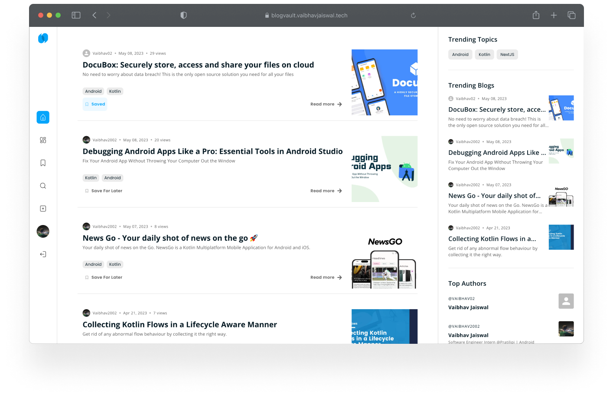
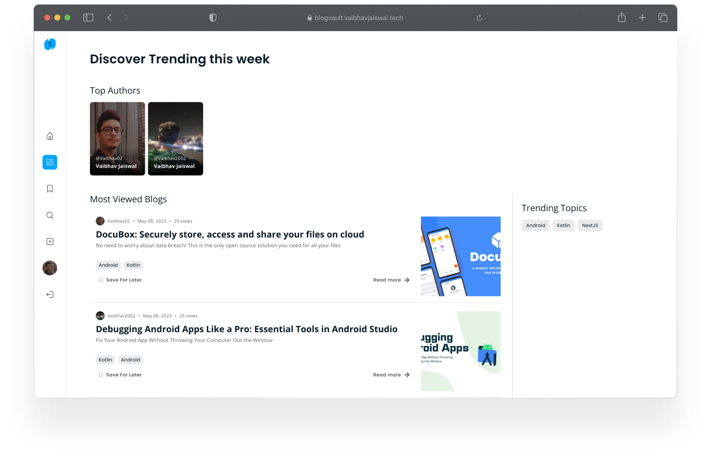

# **BlogVault** - Create and Share Your Stories with BlogVault

Explore Your Passions and Build Your Audience on Our User-Friendly Blogging Platform

## About 🎯

BlogVault is a blogging platform web app built using the MERN Stack using NextJS.
On BlogVault, we can read other's blogs, write our own blogs, and save blogs for later reading.
BlogVault uses the power of NextJS and ReactJS to provide blazing fast content and a great user experience.
From Static Side Generation to ServerSide Rendering to API Routes, it's all there in BlogVault.
**BlogVault** follows all Production practices and Security Measures, like email verification, image format checking,
rate limiting, session invalidation and much more.

## Try it out

You can try BlogVault by visiting: https://blogVault.vaibhavjaiswal.tech

## And that's what BlogVault offers 🔥

## 📸 Screenshots 🖥️

|                                               |                                                |                                                |
|-----------------------------------------------|------------------------------------------------|------------------------------------------------|
|     |  |      |
|   |    |     |
|  |     |  |

## 📸 Screenshots 📱

|                                            |                                              |                                                |                                              |
|--------------------------------------------|----------------------------------------------|------------------------------------------------|----------------------------------------------|
|  |  |  |  |

## Technical details 💡

#### Frontend

- BlogVault is created using NextJS, ReactJS and MaterialUI.
- BlogVault's animations are created using [Framer Motion](https://www.framer.com/motion/).
- BlogVault uses the power of
  NextJS [ServerSide rendering](https://nextjs.org/docs/basic-features/pages#server-side-rendering) to provide content
  blazing fast.
- BlogVault uses the [SWR](https://swr.vercel.app) to fetch client side data and cache, revalidate it for better
  performance.
- BlogVault is highly responsive and looks great on all devices.
- All the React components and package structure is properly organized.

#### Backend

- BlogVault's Backend is created using NodeJS, ExpressJS, MongoDB and Redis.
- BlogVault uses [PassportJS](http://www.passportjs.org) for all authentication methods like Email-password and Social
  Sign-ins.
- BlogVault's backend has the feature to upload images, and it also scales down the images for better storage and
  performance.
- BlogVault's backend **checks images for their type**, so no one can upload other files with image extensions.
- BlogVault uses [Redis](https://redis.io) for caching and storing sessions.
- BlogVault's backend is deployed on my own **Server using [Nginx](https://www.nginx.com)**.
- BlogVault **validates emails** by sending verification emails using Nodemailer.
- BlogVault's Rest APIs are protected using **Rete Limiting**, so its not possible to spam the APIs and cause a DDOS
  attack.

View the respective README files of [frontend](https://github.com/Vaibhav2002/BlogVault/blob/main/frontend/README.md)
and [backend](https://github.com/Vaibhav2002/BlogVault/blob/main/backend/README.md) for more details.

## Tech Stack

#### Frontend

- [NextJs](https://nextjs.org) - Next.js enables you to create full-stack web applications by extending the latest React
  features, and integrating powerful Rust-based JavaScript tooling for the fastest builds.
- [React](https://react.dev) - The library for web and native user interfaces.
- [MaterialUI](https://mui.com) - MUI offers a comprehensive suite of UI tools to help you ship new features faster.
- [Framer Motion](https://www.framer.com/motion/) - A production-ready motion library for React.
- [Lottie](https://lottiefiles.com) - LottieFiles is a collection of animations designed for Lottie and Bodymovin.
- [ReactIcons](https://react-icons.github.io/react-icons/) - Include popular icons in your React projects easily with
  react-icons.
- [React Markdown](https://github.com/remarkjs/react-markdown) - Markdown component for React.
- [React Hook Form](https://react-hook-form.com) - Performant, flexible and extensible forms with easy-to-use
  validation.
- [yup](https://github.com/jquense/yup) - Yup is a JavaScript schema builder for value parsing and validation.
- [Sass](https://sass-lang.com) - Sass is the most mature, stable, and powerful professional grade CSS extension
  language in the world.
- [Axios](https://axios-http.com) - Promise based HTTP client for the browser and node.js.
- [SWR](https://swr.vercel.app) - SWR is a React Hooks library for remote data fetching.
- [Lodash](https://lodash.com) - A modern JavaScript utility library delivering modularity, performance & extras.
- [Typescript](https://www.typescriptlang.org) - TypeScript is a strongly typed programming language that builds on
  JavaScript, giving you better tooling at any scale.

#### Backend

- [NodeJs](https://nodejs.org) - Node.js® is a JavaScript runtime built on Chrome's V8 JavaScript engine.
- [ExpressJs](https://expressjs.com) - Fast, un-opinionated, minimalist web framework for Node.js.
- [MongoDB](https://www.mongodb.com) - MongoDB is a general purpose, document-based, distributed database built for
  modern application developers and for the cloud era.
- [Redis](https://redis.io) - Redis is an open source (BSD licensed), in-memory data structure store, used as a
  database, cache, and message broker.
- [PassportJs](http://www.passportjs.org) - Passport is authentication middleware for Node.js. Extremely flexible and
  modular, Passport can be unobtrusively dropped in to any Express-based web application.
- [Nodemailer](https://nodemailer.com) - Nodemailer is a module for Node.js applications to allow easy as cake email
  sending.
- [Multer](https://github.com/expressjs/multer) - Multer is a node.js middleware for handling multipart/form-data, which
  is primarily used for uploading files.
- [Sharp](https://sharp.pixelplumbing.com) - The typical use case for this high speed Node.js module is to convert large
  images in common formats to smaller, web-friendly JPEG, PNG, WebP and AVIF images of varying dimensions.
- [Bcrypt](https://github.com/dcodeIO/bcrypt.js) - A library to help you hash passwords.
- [Express Session](https://www.npmjs.com/package/express-session) - Simple session middleware for Express.
- [yup](https://github.com/jquense/yup) - Yup is a JavaScript schema builder for value parsing and validation.
- [Morgan](https://www.npmjs.com/package/morgan) - HTTP request logger middleware for node.js.
- [Http Errors](https://www.npmjs.com/package/http-errors) - Create HTTP errors for Express, Koa, Connect, etc. with
  ease.
- [Lodash](https://lodash.com) - A modern JavaScript utility library delivering modularity, performance & extras.

## Project Setup ✏️

View the respective README files of Frontend and Backend to set up the project locally.

- [Frontend](https://github.com/Vaibhav2002/BlogVault/blob/main/frontend/README.md)
- [Backend](https://github.com/Vaibhav2002/BlogVault/blob/main/backend/README.md)

## Contact

If you need any help, you can connect with me.

Visit:- [Vaibhav Jaiswal](https://vaibhavjaiswal.vercel.app/#/)